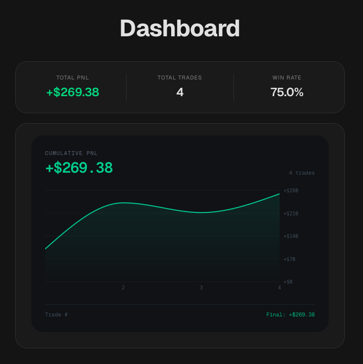

# Trading Journal



A full-stack trading journal application built with Next.js, Supabase, and PostgreSQL.

Designed to help traders track performance, review trade history, and analyze trading consistency through authenticated user-specific dashboards and analytics.

## 📝 Overview

Trading Journal is an MVP SaaS-style application focused on:
- authenticated user workflows
- secure user-isolated trade storage
- server-side rendering & protected routes
- analytics derivation
- scalable application architecture using the Next.js App Router

The project emphasizes clean architecture, reusable business logic, and modern full-stack development patterns.

## 🔥 Features

### Authentication

- Secure email/password authentication
- Protected application routes
- Password reset flow
- Session-based authentication using Supabase Auth

### Trade Management

- Create trades
- Edit existing trades
- Delete trades
- User-isolated trade data using PostgreSQL Row Level Security (RLS)

### Analytics

- Total PNL
- Win rate
- Total trades
- Cumulative PNL visualization using Recharts

### User Experience

- Reponsive mobile-friendly layouts
- Shared reusable form architecture
- Loading states and validation
- Structured dashboard layout

## 💻 Tech Stack

### Frontend

- Next.js (App Router)
- TypeScript
- Tailwind CSS

### Backend

- Next.js Server Components + Route Handlers
- Supabase SSR Authentication

### Database/Auth

- Supabase
- PostgreSQL
- Row Level Security (RLS)

### Charts

- Recharts

### Deployment

- Vercel
- Supabase

## 🔐 Database Schema

### `trades`

- id | uuid | Primary Key
- user_id | uuid | Trade owner
- pnl | float8 | Required
- result | text | win/loss
- notes | text | Optional
- mistake | text | Optional
- created_at | timestamp | Default `now()`

### RLS Policies

- INSERT: users can insert their own trades
- SELECT: users can view their own trades
- UPDATE: users can update their own trades
- DELETE: users can delete their own trades

## 🏗️ Architecture Highlights

### Authentication & Route Protection

- Uses Supabase Auth with server-side session validation
- Protected application routes are centralized throught the `(app)` layout
- Unauthenticated users are redirected before protected pages render

### Data Security

- Trade ownership is enforced using PostgreSQL Row Level Security (RLS)
- Users can only create, view, update, and delete their own trades

### Server/Client Separation

- Server Components handle authenticated data fetching and analytics derivation
- Client Components manage interactive UI concerns such as forms and charts

### Shared Business Logic

- Trade analytics are centralized into reusable utility modules
- Derived statistics and cumulative PNL calculations are separated from presentation components

### Scalable App Router Structure

- Route groups separate:
    - marketing pages
    - authentication flows
    - protected application routes

### Responsive UI System

- Shared reusable card, button, and form architecture
- Mobile-responsive layouts using centralized global styling

## 📁 Project Structure

```
src/
├── app/
│   ├── (app)/
│   ├── (auth)/
│   └── (marketing)/
├── components/
├── features/
├── lib/
└── types/
```

## 📈 Development Notes

Progress and development insights are tracked in `progress-log.md`.

## 🚧 Future Improvements

- Trade tagging & filtering
- Strategy analytics
- Chart uploads
- Mistake categorization
- AI-generated trade insights
- Backtesting tools
- Propfirm tracker

## 🚀 Status

MVP nearing deployment.
